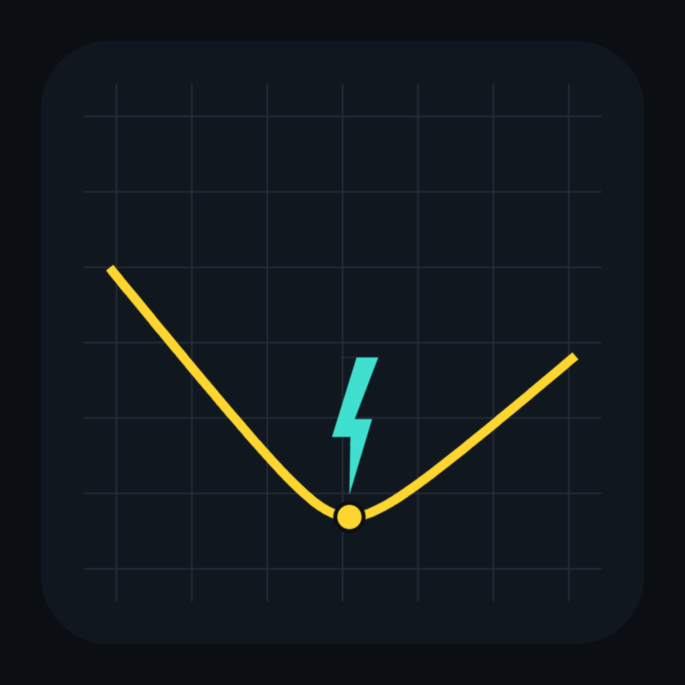
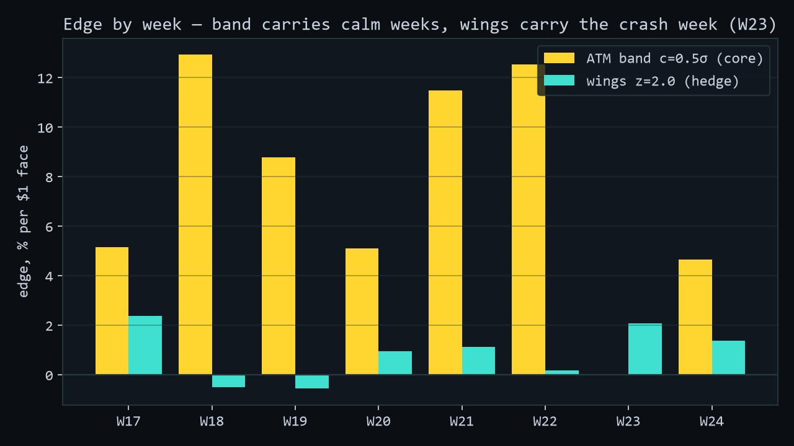

<div align="center">


# VoltEdge

**An options desk for [DeepBook Predict](https://docs.sui.io/onchain-finance/deepbook-predict/) —
live volatility surface, no-arbitrage monitoring, vault risk Monte-Carlo,
and an autonomous strategy trading on Sui testnet with on-chain receipts.**

*Sui Overflow 2026 · DeepBook track*

</div>

---

## The numbers first

| Claim | Proof |
|---|---|
| Bit-exact mirror of the on-chain pricing pipeline | **every quoted strike, 0 units diff** vs live `devInspect`; re-runnable in your browser from the **Proof tab** |
| The mirror, promoted **on-chain** | our deployed Move package [`voltedge_attestor`](packages/move/voltedge_attestor) (`0xa5df8faa…0b8d`) re-derives `N(d2)` using the protocol's own public math and emits a `FairPriceAttested` event — **22/22 bit-exact (0 units)** vs the mirror on live oracles |
| The **no-arb watchdog, on-chain** (both dimensions) | the deployed package (`0x802e7c37…40f0`) recomputes **both** no-arb checks **on-chain** with the protocol's own math: butterfly density `g(k)` (`ArbitrageFlagged` when `g < 0`) and calendar variance monotonicity `w_near(k) ≤ w_far(k)` across expiries (`CalendarArbFlagged` when `w_near > w_far`) — **bit-exact, 0 units** vs the mirror on live oracles (representative runs: 32–46/× butterfly, 28/28 calendar). *The protocol stores the SVI surface but never checks it for arbitrage.* |
| **On-chain slippage guard** | the protocol's `mint` has no cost ceiling (post-trade quoting); our `guard::safe_mint` quotes the cost and mints **atomically** only if `cost ≤ max_cost`. Proven live via devInspect: mints within the ceiling, **reverts one unit past it** (`ESlippage`) — no fill above `max_cost`. |
| Live execution matches the mirror | first live mint within **1e-6** of prediction ([tx](https://suiscan.xyz/testnet/tx/2Udm7NxHdnqettS5LaN3MVviis6jroDdxWbw5FxMHsip)) |
| **Provable** live track record | the bot's manager is up **~+80% on its $400 deposit** — not a claim: it's the manager's on-chain **account value − deposits** (one $400 deposit, zero withdrawals), verifiable on Suiscan and in the browser (**Ladder tab → Provable P&L**). Updates live as it trades. |
| The feed misprices the distribution's *shape* | mature-era backtest (n=2,369 of 2,620): ATM band hits **46.9%** vs **38.2%** implied → **+7.7%/$1 after spread** (t = 7.5); +6.7% (t=6.9) on the full sample |
| Real protocol findings | cross-tier calendar arbitrage (live), settlement delays up to **8.7h**, SVI-staleness gate gap, indexer range-PnL blind spot |
| Tests | **61 test definitions** parametrizing **~283 runtime cases** — 245 are golden-vector rows checked against *independent routes* (scipy CDF/PDF/inverse, finite-difference SVI derivatives, call-spread-limit digitals) |

<div align="center">

<br/><em>The barbell: ATM band carries calm weeks, far wings carry the crash week.</em>
</div>

## Who it's for

- **The DeepBook Predict team** — a continuous, **on-chain** no-arbitrage watchdog over the BlockScholes volatility feed. Our deployed Move package re-checks the live surface for butterfly and calendar arbitrage every poll and emits `ArbitrageFlagged` / `CalendarArbFlagged` — events anyone can subscribe to. The protocol stores the SVI surface but never checks it; this is the monitoring layer a new derivatives primitive needs, and it has already surfaced real issues on the live feed.
- **PLP liquidity providers** — the **Vault** tab is a risk console for the people funding the counterparty pool: a skew-aware Monte-Carlo of the reconstructed strike book, P(exposure > 80% of balance), tail-loss quantiles, cross-checked against an independent analytic route. See your exposure, don't guess it.
- **Volatility traders** — the **edge**: where the feed misprices the distribution's *shape* (butterfly / calendar / skew), quantified per strike, harvested by an autonomous barbell — **provably up ~+80% on $400** on testnet (`account value − deposits`, on-chain).

## What's inside

**The terminal** (`npm run dev`, read-only, zero setup):

- **Surface** — live SVI implied-vol smiles across all expiry tiers, with time-travel replay
- **No-Arb** — butterfly g(k) ≥ 0, calendar monotonicity, parameter sanity on every SVI refit; catches real violations live — and **both** the g(k) and calendar checks are re-derived **on-chain** by our Move package (`ArbitrageFlagged` / `CalendarArbFlagged`)
- **Edge** — protocol N(d2) vs smile-consistent digital prices, heatmap vs half-spread
- **Proof** — *run the bit-exactness proof yourself*: atomic devInspect snapshots quoted against our mirror, expect `0 units`
- **Vault** — PLP snapshot + 20,000-path **skew-aware** Monte-Carlo of the reconstructed strike book (terminal prices drawn from the full smile-implied density), cross-checked against an independent analytic route ([`mc_validate.py`](research/mc_validate.py)), in-browser
- **Health** — keeper freshness in chain time, settlement-delay forensics
- **Ladder** — the live bot console: equity curve, positions, Suiscan-linked trade log

**The mirror** (`packages/core`) — the on-chain integer pipeline
(`ln/sqrt/exp/normal_cdf` with Cody coefficients, sign-magnitude i64,
`compute_nd2`, Bernoulli+utilization spread) reimplemented in BigInt:
same constants, same operation order, same truncation.

**The research** (`research/`) — resumable history fetcher, 2,620-cycle
backtest with settlement-delay filters and era segmentation,
[sim_report.md](research/sim_report.md) with honest limitations, and the
[retracted stale-vol hypothesis](research/STALE_VOL.md) kept as an audit
trail of the methodology.

**The executor** (`packages/strategy`) — barbell strategy (ATM range
`mint_range` + far-wing `mint`s in one PTB), chain-state-sized
settlement sweeps (robust to external keepers), append-only journal,
chain-clock calibration (local clocks lie; we measured +39.6s).

## Quick start

```bash
npm install
npm run dev            # the terminal, live against testnet
npm test               # core + strategy tests (61 defs, ~283 runtime cases)
cd packages/chain && npx tsx scripts/mirror-difftest.ts   # the CLI proof
```

Full operations guide: [docs/RUNBOOK.md](docs/RUNBOOK.md) ·
Design: [docs/DESIGN.md](docs/DESIGN.md) ·
Protocol notes: [docs/protocol-notes/](docs/protocol-notes/)

## Live artifacts (Sui testnet)

| | |
|---|---|
| PredictManager | `0xe2ad1c2a75a5f4798a2ef38bdc8bc53a6084d03503cdb84baffd1f0c03861cc3` |
| First barbell cycle | mint [`2Udm7NxH…`](https://suiscan.xyz/testnet/tx/2Udm7NxHdnqettS5LaN3MVviis6jroDdxWbw5FxMHsip) → sweep [`2i49HrGQ…`](https://suiscan.xyz/testnet/tx/2i49HrGQ6qVtTZxVQXb9KTQj1g5XKDXuTkBVJeJCNVWy) |
| PLP supply (we LP the vault we trade) | [`9RJYTJRZ…`](https://suiscan.xyz/testnet/tx/9RJYTJRZ7FvtmVNKQP67Z34SwBFdU2sCVPe4zDzbmwrS) |
| Walrus Sites object | `0xd8552738ac4e9f0da79d1730b9ef531e238634af3ead8c810207d5e6e0c695fd` |
